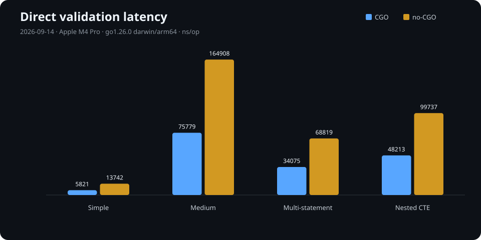
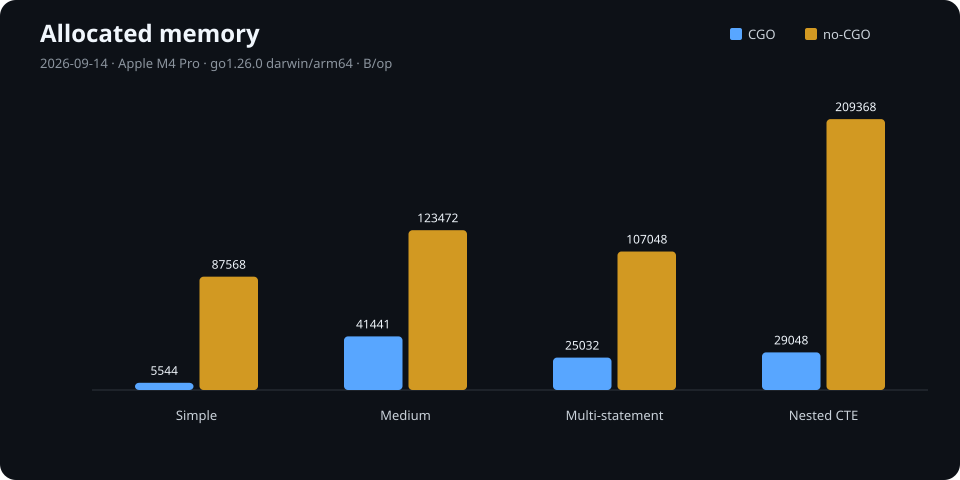
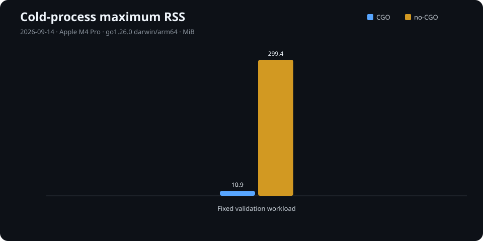
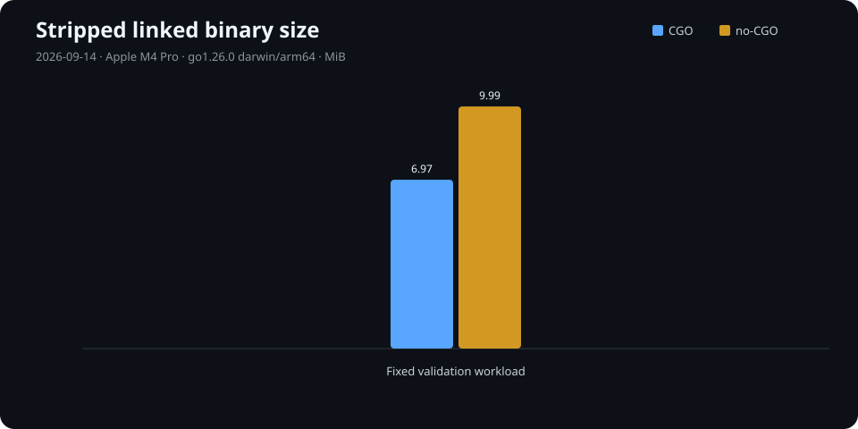

# postgres-sqlguard

<p align="center">
  
</p>
<p align="center"><sub><a href="docs/assets/sqlguard-mascot.md">Artwork provenance and attribution</a></sub></p>

[](https://github.com/almostinf/postgres-sqlguard/actions/workflows/lint.yml)
[](https://github.com/almostinf/postgres-sqlguard/actions/workflows/test.yml)
[](https://codecov.io/gh/almostinf/postgres-sqlguard)
[](https://pkg.go.dev/github.com/almostinf/postgres-sqlguard)
[](LICENSE)

Stop dangerous PostgreSQL statements before they reach your database.

`postgres-sqlguard` is a driver-independent Go library that parses complete SQL
with a real PostgreSQL grammar and applies only the safety rules your
application explicitly enables. It needs no database connection and never
executes SQL.

## Why SQLGuard

- **PostgreSQL-aware** — decisions come from parsed structure, not regexes or
  keyword matching.
- **Fail closed** — malformed input is rejected before any rule runs, and every
  top-level statement and statement-bearing CTE is inspected.
- **Explicit policy** — built-in and application rules compose in a stable,
  deterministic order; nothing is enabled globally or implicitly.
- **Driver-independent** — keep the validation core separate from pgx,
  `database/sql`, and connection lifecycle choices.
- **Privacy-safe** — typed errors and bounded observability events never expose
  SQL text, literals, arguments, credentials, or raw parser diagnostics.
- **CGO or no-CGO** — use the faster native parser by default or build the same
  public API with an automatically selected WebAssembly backend.

## Install

```sh
go get github.com/almostinf/postgres-sqlguard@latest
```

SQLGuard requires Go 1.26. `CGO_ENABLED=1` also requires a working C compiler;
`CGO_ENABLED=0` requires no compiler or custom build tag.

## Quick start

```go
package main

import (
	"context"
	"errors"
	"fmt"

	sqlguard "github.com/almostinf/postgres-sqlguard"
	"github.com/almostinf/postgres-sqlguard/pkg/rules"
)

func main() {
	engine, err := sqlguard.NewEngine(
		sqlguard.EngineOptions{},
		rules.NewUpdateRequiresWhere(),
	)
	if err != nil {
		panic(err)
	}

	err = engine.Validate(
		context.Background(),
		"UPDATE accounts SET active = false",
	)

	var violation *sqlguard.Violation
	if errors.As(err, &violation) {
		fmt.Println("rejected by", violation.RuleID())
	}
}
```

Output:

```text
rejected by update_requires_where
```

The equivalent [executable example](example_test.go) is compiled and run by the
test suite.

## Built-in policies

Import the optional rules from
`github.com/almostinf/postgres-sqlguard/pkg/rules`:

| Constructor | What it prevents |
| --- | --- |
| `NewUpdateRequiresWhere` | `UPDATE` without a syntactic `WHERE` clause |
| `NewDeleteRequiresWhere` | `DELETE` without a syntactic `WHERE` clause |
| `NewInsertRequiresColumns` | `INSERT` without an explicit target-column list |
| `NewDenyTruncate` | Every `TRUNCATE` statement |
| `NewDenyDropTable` | Every `DROP TABLE` statement |
| `NewDenyAlterTable` | Every `ALTER TABLE` statement |

Register only what your application needs. Comments and string literals cannot
fake an operation or a required clause because the rules inspect the parsed
tree. A syntactic predicate such as `WHERE TRUE` is still a `WHERE` clause;
SQLGuard does not attempt semantic tautology analysis.

Read the [validation guide](docs/validation-guide.md) for custom rules,
prepared validation, traversal, typed errors, context, concurrency, and the
complete privacy boundary.

## How validation works

The engine parses the entire input before evaluating policy. For valid SQL it
visits top-level statements in input order, then statement-bearing CTEs
depth-first, and runs rules in registration order. The first rejection returns
a typed `Violation`. Parser failures return a typed `ParseError`; callers use
standard `errors.As` and `errors.Is` inspection rather than parsing messages.

Constructed engines and prepared values are safe for concurrent use. A custom
rule or observability sink may be invoked concurrently and therefore owns the
synchronization of its mutable state.

## Choose a parser backend

Both builds expose the same API, PostgreSQL 17 grammar, parser-neutral rule
view, validation results, and privacy guarantees. Selection happens at build
time:

| Build | Best for | Trade-off |
| --- | --- | --- |
| `CGO_ENABLED=1` | Lowest validation cost and smaller binaries | Requires a working C toolchain |
| `CGO_ENABLED=0` | Simple cross-compilation and environments without a C compiler | Higher cold-start time, memory, and binary size |

On an Apple M4 Pro with Go 1.26, five-run median direct-validation latency
ranged from `5,821–75,779 ns/op` for CGO and `13,742–164,908 ns/op` for no-CGO
across the four inputs below.

When validation runs immediately before a driver call, that measured
in-process work corresponds to the following time per check:

| Input | CGO | no-CGO |
| --- | ---: | ---: |
| Simple | `0.000005821 s` | `0.000013742 s` |
| Medium | `0.000075779 s` | `0.000164908 s` |
| Multi-statement | `0.000034075 s` | `0.000068819 s` |
| Nested CTE | `0.000048213 s` | `0.000099737 s` |

<p align="center">
  
  
</p>
<p align="center">
  
  
</p>

These 2026-09-14 measurements come from one documented host, not portable
limits or predictions. They measure in-process validation without a database
round trip, so the seconds above are the validator's absolute runtime rather
than a measured end-to-end delta against an unguarded database call. `ns/op` is
execution time, not sampled CPU utilization. See the [release benchmark
evidence](docs/benchmarks/2026-09-14/README.md) for raw runs, exact units,
medians, environment, methodology, and regeneration, or [Parser
backends](docs/parser-backends.md) for the supported matrix and backend details.

## Observability

Observability is opt-in through `EngineOptions`. Use your own `Metrics` and
`Logger` implementations or the official packages:

- [`pkg/observability/prometheus`](pkg/observability/prometheus) records the
  bounded `service`, `mode`, `outcome`, and `rule_id` labels in a caller-owned
  registry;
- [`pkg/observability/slog`](pkg/observability/slog) emits a stable message and
  the bounded `mode`, `outcome`, and `rule_id` attributes through `log/slog`.

Sink failures and panics never replace validation results or weaken an
enforce-mode rejection. Read the [observability guide](docs/observability.md)
for configuration and failure semantics.

## Integration boundaries

SQLGuard validates only the calls your application sends through it. It does
not intercept driver traffic, bind arguments, enforce PostgreSQL privileges,
replace transactions or constraints, or prove that arbitrary SQL is safe for a
particular business operation.

The repository includes compiling examples for a narrow
[pgx wrapper](example/pgx) and a bounded
[prepared-validation cache](example/pgx-prepared). They demonstrate patterns,
not stable production adapters. Read [Integrating with pgx](docs/pgx-integration.md)
before adopting their boundary.

## Documentation

- [Release notes for v1.0.0](docs/releases/v1.0.0.md)
- [Validation guide](docs/validation-guide.md)
- [Parser backends and reproducible measurements](docs/parser-backends.md)
- [Release benchmark evidence](docs/benchmarks/2026-09-14/README.md)
- [Observability guide](docs/observability.md)
- [Integrating with pgx](docs/pgx-integration.md)
- [Continuous integration and required checks](docs/ci.md)
- [Stable release runbook](docs/release-runbook.md)
- [Licensing and attribution review](docs/licensing.md)
- [Product requirements](docs/product-requirements.md)
- [Contributing](CONTRIBUTOR.md)
- [Third-party notices](THIRD_PARTY_NOTICES.md)

## License

Licensed under [Apache-2.0](LICENSE). The project retains this permissive
license for its explicit contributor patent grant; see the
[licensing and attribution review](docs/licensing.md) for the decision,
redistribution notes, and third-party scope.
